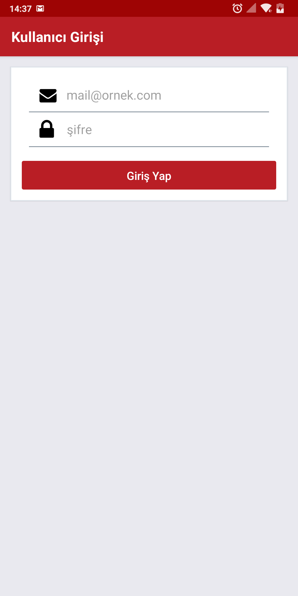

# acilkan
Acil Kan Mobil Uygulaması

## Çalıştırma Aşamaları

 - React Native Cli Kur ( **_npm install -g react-native-cli_** )
 - npm paketlerini kur ( **_npm install_** )
 - font awesome bağlantısını gerçekleştir ( **_react-native link react-native-vector-icons_** )
 - çalıştır ( **_react-native run-android_** )

## Ekran Görüntüleri
    